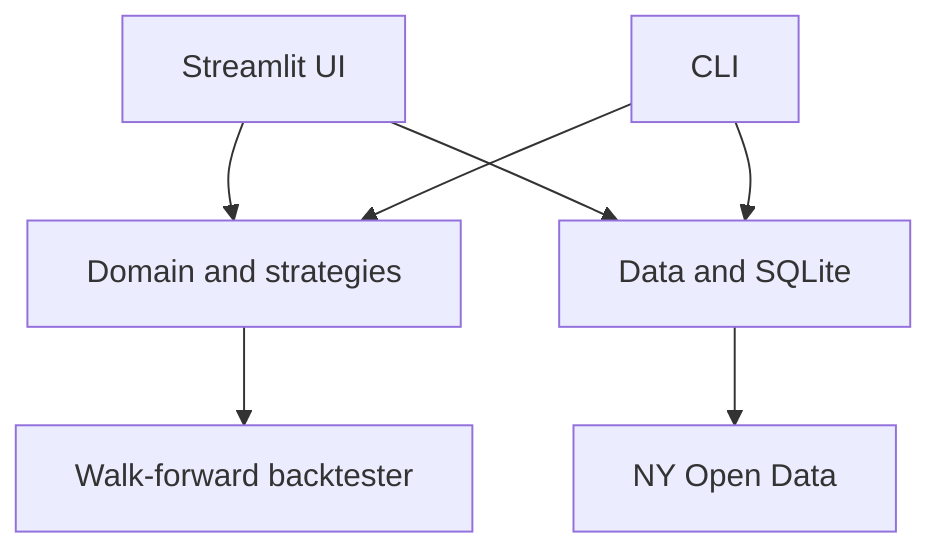

# Architecture

Lotto Lab is intentionally organized around one reusable Python engine. The CLI and Streamlit interface are adapters; neither owns statistical behavior.

## Modules

| Module | Responsibility |
|---|---|
| `domain.py` | Games, rule eras, validated draws, tickets, and schedules |
| `data.py` | NY Open Data ingestion, response normalization, SQLite persistence, locked predictions |
| `strategies.py` | Transparent scoring algorithms and weighted sampling without replacement |
| `backtest.py` | Walk-forward evaluation, random baselines, scoring, and bootstrap intervals |
| `cli.py` | Reproducible commands for synchronization, generation, and testing |
| `ui/app.py` | Lightweight local research interface |

## Dependency direction

The interfaces depend on the engine, never the reverse:

## Local persistence

By default, data is stored in `~/.lotto-lab/lotto.db`. Set `LOTTO_LAB_DATA_DIR` to move it, or pass `--database` before the CLI subcommand for an isolated database.

Draws are keyed by game and date. Predictions contain the algorithm version, data cutoff, random seed, parameters, generated tickets, target date, and creation timestamp. The unique constraint prevents the same version/seed combination from being silently replaced for a target drawing.

## Future Swift application

The Python version is the research reference implementation. If a native Apple application is created, the strategy definitions, fixtures, seeded examples, and backtest outputs provide a test oracle for the Swift port. Another option is to expose the engine through FastAPI, but a pure Swift port is preferable for an offline iPhone/iPad application.

